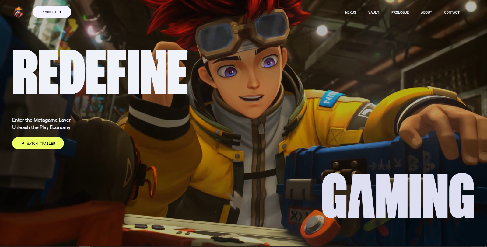
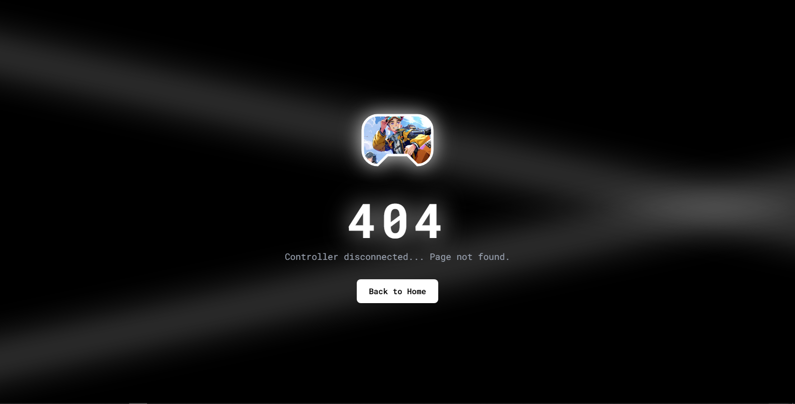

<div align="center">

# Zentry — Metagame Layer Experience

</div>

> Enter the Metagame Layer — a sleek, animated app uniting UI, motion, and immersive sections inspired by Zentry.

## Live Demo

- Click here to visit the live site: [Click here](https://zentry-kappa-jet.vercel.app/)

<a href="https://zentry-kappa-jet.vercel.app/">
  
</a>

## 404 Page Preview

Custom, stylized 404 experience:



## Tech Stack

-  Next.js 15 (App Router, Turbopack)
-  React 19
-  TypeScript 5
-  Tailwind CSS 4 (via `@tailwindcss/postcss`)
-  GSAP 3 + `@gsap/react` for animations
-  Deployed on Vercel

## Features

- Animated hero and section transitions powered by GSAP
- Bento-style content grid with subtle tilt and hover effects
- Custom fonts and theme tokens in `src/app/globals.css`
- Optimized assets in `public/` (images, videos, audio)
- Responsive, mobile-first design

## Local Development

```bash
npm install
npm run dev
```

Open `http://localhost:3000` in your browser.

## Scripts

- `dev`: Run local dev server with Turbopack
- `build`: Production build with Turbopack
- `start`: Start production server
- `lint`: Run ESLint

